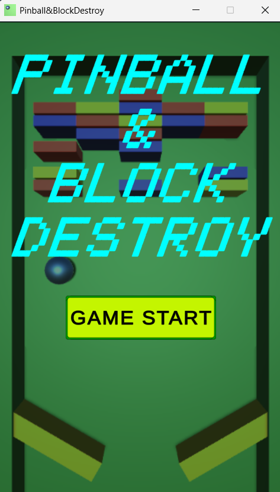
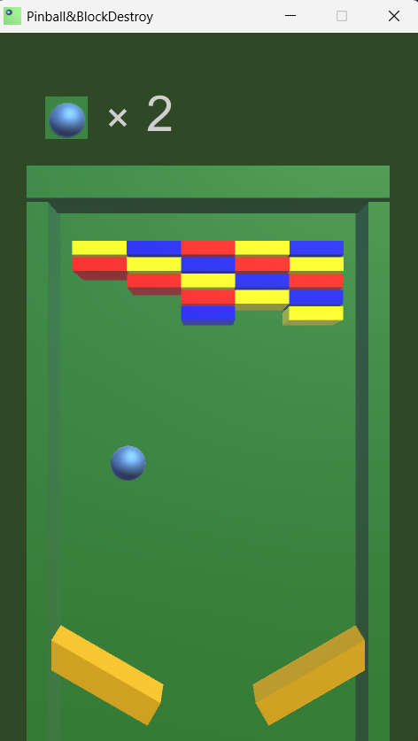

# PINBALL & BLOCK DESTROY

## 概要
このゲームはピンボールとブロック崩しを組み合わせたようなゲームです。

高校時代に文化祭で展示しました。その後も、ゲームの改善を目的として少しずつ改良を加えています。

## スクリーンショット
### タイトル画面

### ゲーム画面

## 開発
### 開発環境
- Unity
- C#
- Visual Studio
### 担当
- ゲーム開発
- 文化祭当日のブース運営

## 反省点・今後の展望
プロジェクトの時期が大学受験の時期と重なったため、プレイヤーへのアンケート調査や広告・宣伝活動まで十分に取り組むことができませんでした。

この経験を踏まえ、学生時代のうちにもう一度ゲームの企画・開発から公開までを一通り行うプロジェクトに取り組みたいと考えています。

次回はゲームの開発だけでなく、広告動画を自分で制作し、YouTubeで公開するところまで含めた、一連のプロジェクトとしてしっかり取り組みたいと考えています。

## プレイログの収集について
ゲームの展示後も、さまざまな改善を加えてきました。

その一環として、ゲームのプレイログを収集する機能を実装しました。

### 使用技術
- Supabase
### 収集データ
- 1プレイ終了時の日時
- 1プレイ終了時の体力（HP）
### 収集理由
- ゲームの難易度改善の参考にするため。

